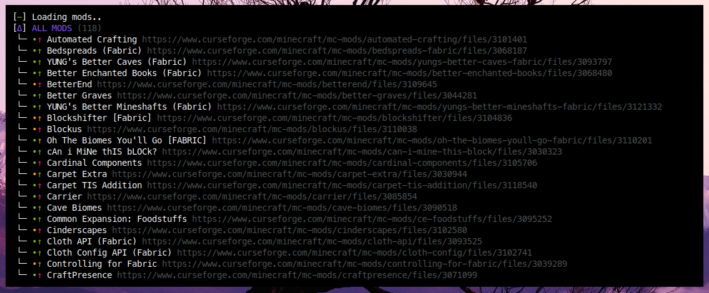

# 📦 PAX - The minecraft modpack manager



PAX is a modpack manager for modpack developers. It supports Forge & Fabric, development with git, and exporting to a `*.zip` for uploading to Curseforge.

> PAX is currently in an early development stage and may be unstable / contain bugs and errors. If you're having issues, look into the issue tracker to see if your problem has already been solved or submit a new issue if it hasn't.

## Usage

> At any time, if you feel like you're lost, you can execute `./pax help`, or similarily `./pax --help` or `./pax <SUBCOMMAND> --help` to get some information about what you can do.

### Creating your modpack

First things first: Create a new folder for your shiny new modpack (or move it to an already existing, preferably empty folder where you'd like to create the pack) and drop your downloaded version of PAX in there.

> To start work on your modpack, execute `./pax init` and follow the instructions.

If you have entered all the details and it worked: Well done! Your directory structure should now look like this:

```
├── modpack/
│   ├── overrides/
│   └── manifest.json
└── pax (or pax.exe under Windows)
```

If you've ever downloaded a `.zip` modpack from curseforge before, you'll see that the folder/file structure in `modpack/` is remarkably similar to that. In fact, whenever you'll export your pack, PAX does nothing else than just build a `.zip` containing everything in `modpack/` !

### Installing/Updating/Removing mods

In order to enjoy some mods in your custom modpack, you'll need to install them first.

>Install mods by executing `./pax install <modname>`.

You'll be presented with a list of mods that match your modname (Mods you already have installed will have a `[installed]` tag). Select the one you need by entering it's number.

You can update and remove mods the same way.

> Update mods by executing `./pax update <modname>`, and remove mods by executing `./pax remove <modname>`.

When you're installing or updating mods, you can specify an optional `--strategy` parameter to control how PAX selects what version to install:
- `recommended`: PAX will install/update to the latest version of this mod for your current modpack version. If your modpack version is `1.16.1`, PAX will install the newest version that is compatible with `1.16.1`.
- `newest` PAX will install/update to the latest version of this mod for the current minor minecraft version. Mods installed this way will **probably** work. For example, if your modpack version is `1.16.1`, PAX may also install versions of your selected mod that only specify `1.16.4` as a working version.

### Listing your mods

Since the `projectID`s and `fileID`s in your manifest don't actually tell you much about your currently installed mods, PAX has a command to list information about these.

> Execute `./pax ls` to display your currently installed mods & information about them.

## PAX Development

You'll need:
* [Nim](https://nim-lang.org/)
* A C compiler (depending on your operating system, one might be already installed)

Clone the repository - and you're good to go!
To build the application, run `nimble build` & execute it with `./pax` (on Linux) or `./pax.exe` (on Windows).

---

## License

PAX is licensed under the [MIT License](license.md).